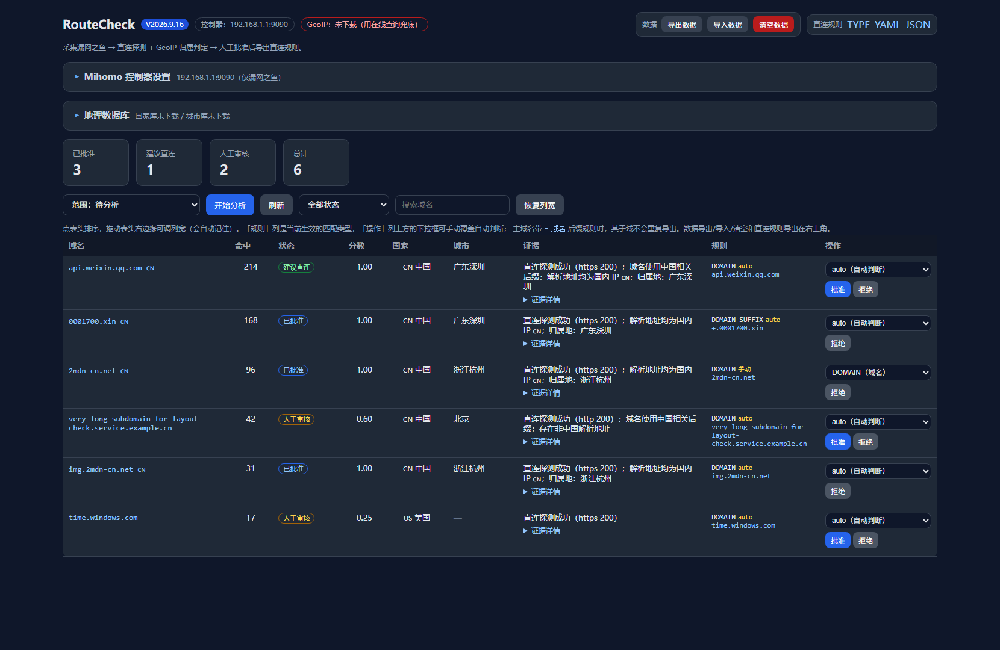

# RouteCheck
用于 OpenWrt + Nikki/Mihomo 的“漏网之鱼”域名采集、二次分析和直连规则生成器。
项目主页：<https://github.com/Seven1echo/RouteCheck>



## 一、工作方式
1. 周期调用 Mihomo 控制器的 `GET /connections`。
2. 默认只采集最终规则命中 `MATCH` / `漏网之鱼` 且实际走了代理链的连接。
3. 域名去重并记录命中次数、最近出现时间、规则、策略链和目标地址。
4. 对待分析域名执行直连 DNS、直连 HTTP/TLS 探测，并做 IP 归属判定（国家 + 城市）。
5. 直连探测成功且解析地址全部为国内 IP 时，域名会带上 🇨🇳 标注，并可看到 IP 所属城市。
6. 只有高置信度结果才进入“建议直连”，人工批准后才会进入导出规则。

> 这是辅助工具，不可能仅凭一次连接 100% 判断“应该直连”。默认策略偏保守：探测失败或 GeoIP 不明确的域名保留为待审核。
> 如果 Nikki/Mihomo 的控制器只监听本机，需要在 Nikki 的外部控制器设置中开放给 Docker 所在设备访问；不要把控制器端口暴露到公网。


## 二、部署到 Linux （Docker Hub 镜像）
不想自己构建镜像时，直接用 Docker Hub 上的 **RouteCheck 部署镜像**。

### 1. 创建数据目录
```bash
mkdir -p /opt/routecheck/data /opt/routecheck/geoip
```

### 2. 拉取最新版镜像
```bash
docker pull seven1echo/routecheck:latest
```

### 3. 创建并运行容器
```bash
docker run -d \
  --name routecheck \
  --restart unless-stopped \
  -p 8787:8787 \
  -v /opt/routecheck/data:/data \
  -v /opt/routecheck/geoip:/geoip \
  -e TZ=Asia/Shanghai \
  seven1echo/routecheck:latest
```


## 三、部署到 Windows（Docker Hub 镜像）
### 1. 创建 Docker Volume
创建 RouteCheck 数据卷（）：
```
docker volume create routecheck-data
docker volume create routecheck-geoip
```

### 2. 拉取最新版镜像
```
docker pull seven1echo/routecheck:latest
```

### 3. 创建并启动容器
```
docker run -d `
  --name routecheck `
  --restart unless-stopped `
  -p 8787:8787 `
  -v routecheck-data:/data `
  -v routecheck-geoip:/geoip `
  -e TZ=Asia/Shanghai `
  seven1echo/routecheck:latest
```


## 四、使用方法
### 1. 访问
容器启动后访问：
```text
http://<服务器IP>:8787
```

### 2. 常用命令
查看运行状态：
```bash
docker ps --filter name=routecheck
```

### 3. 查看日志：
```bash
docker logs -f routecheck
```

### 4. 停止容器：
```bash
docker stop routecheck
```

### 5. 删除容器：
```bash
docker rm -f routecheck
```
### 6. 网页配置
打开首页顶部的 **Mihomo 控制器设置** 面板即可在线修改，保存后立即生效并写入数据库，重启容器后依然保留：

| 项目 | 说明 |
|---|---|
| IP / 主机 | 控制器地址，可填 `192.168.1.1`、`192.168.1.1:9090` 或 `http://192.168.1.1:9090` |
| 端口 | external-controller 端口，默认 `9090` |
| 密钥 | external-controller secret，留空表示无密钥 |
| 采集模式 | `仅漏网之鱼 / MATCH` 或 `全部代理连接` |
| 采集间隔 | 轮询 `/connections` 的间隔（秒，最小 2） |
| 在线查询城市 | 本地没有城市库时，允许用 HTTP 接口查询城市名 |

按钮说明：**保存设置** 写库并热生效；**测试连接** 请求 `/version`、`/connections`、`/dns/query` 并显示结果；**恢复环境变量默认** 清除网页覆盖值。

网页里保存的值优先于 `.env` 中的环境变量。

## 五、地理数据库（部署后下载，镜像不预装）

网页顶部的「Mihomo 控制器设置」和「地理数据库」两个面板都是**可折叠**的（默认收起，标题右侧直接显示当前状态，展开状态记在浏览器里）；右上角是「数据」（导出/导入/清空）和「直连规则」（TYPE/YAML/JSON）两组按钮。

镜像里**不含** `.mmdb` 文件（只有 `./geoip` 挂载目录），部署后到网页的「地理数据库」面板里下载，两个地址都可以改成你自己的源：

| 库 | 默认源 | 大小 |
|---|---|---|
| 国家库 | MetaCubeX `meta-rules-dat` 的 `country.mmdb`（jsDelivr 镜像） | ≈7.5MB |
| 城市库 | P3TERX `GeoLite.mmdb` 的 `GeoLite2-City.mmdb`（MetaCubeX 不发布城市库） | ≈65MB |

下载是后台任务，页面会显示进度；文件先写临时名，校验是有效 mmdb 后才原子替换，失败不会破坏已有文件。「启动时自动下载缺失的库」默认开启，可用 `AUTO_DOWNLOAD_GEOIP=0` 关掉。

> 之前已经分析过的域名不会自动补归属地，下载完库之后用工具栏的 **范围：缺归属地（补国家/城市）** 重新分析一次即可。

## 六、归属地标注

- **国家** 列：只显示国家缩写 + 中文名，例如 `CN 中国`、`US 美国`（不再叠国旗，避免重复）。
- **城市** 列：显示国内城市，例如 `广东深圳`（本地城市库或在线查询得出）。
- 只有“直连探测成功 + 解析地址全部为国内 IP”时，域名后面才会追加 🇨🇳 标记（`cn_direct`）。

城市信息优先来自本地 `GeoLite2-City.mmdb`，其次是 `GeoLite2-Country.mmdb`（只能给国家），最后才是可选的在线查询。也可以自己把数据库放进 `./geoip/` 目录：

```text
geoip/GeoLite2-City.mmdb
geoip/GeoLite2-Country.mmdb
```

## 七、关键配置

| 变量 | 默认值 | 说明 |
|---|---:|---|
| `MIHOMO_URL` | `http://192.168.1.1:9090` | Mihomo external-controller 地址（网页可覆盖） |
| `MIHOMO_SECRET` | 空 | external-controller 密钥（网页可覆盖） |
| `POLL_INTERVAL_SECONDS` | `5` | 采集间隔（网页可覆盖） |
| `CAPTURE_MODE` | `leak_rule` | `leak_rule` 仅捕获漏网规则；`all_proxy` 捕获全部代理连接 |
| `LEAK_RULE_PAYLOADS` | `漏网之鱼,MATCH` | 允许的 rulePayload，逗号分隔 |
| `ANALYZE_INTERVAL_SECONDS` | `60` | 二次分析间隔 |
| `ANALYZE_CONCURRENCY` | `4` | 同时分析多少个域名（1~16） |
| `DIRECT_PROBE_TIMEOUT_SECONDS` | `5` | 直连探测超时 |
| `GEOIP_DB_PATH` | `/geoip/GeoLite2-Country.mmdb` | 可选 MaxMind 国家库 |
| `GEOIP_CITY_DB_PATH` | `/geoip/GeoLite2-City.mmdb` | 可选 MaxMind 城市库（推荐，能出城市） |
| `GEOIP_COUNTRY_URL` / `GEOIP_CITY_URL` | MetaCubeX / P3TERX | 网页里的默认下载地址 |
| `AUTO_DOWNLOAD_GEOIP` | `1` | 启动时自动下载缺失的库 |
| `ONLINE_GEO_LOOKUP` | `1` | 本地库无城市时是否在线查询城市 |
| `GEO_LOOKUP_URL` | `ip-api.com` 模板 | 在线查询地址模板，需包含 `{ip}` |
| `AUTO_DIRECT_SCORE` | `0.85` | 自动进入建议直连的最低分数 |
| `DATABASE_PATH` | `/data/routecheck.db` | SQLite 数据库路径 |

## 八、接入 Nikki 规则
容器生成的纯文本规则地址：
`http://分析器IP:8787/api/rules/direct.txt`

导出的是带类型判断的 `type` / `payload` 结构（后缀规则带 `+.` 前缀）：
```yaml
- type: DOMAIN
  payload:
  - "2mdn-cn.net"

- type: DOMAIN-SUFFIX
  payload:
  - "+.0001700.xin"
```

类型判断规则：
| 情况 | 输出 |
|---|---|
| 已批准的是站点主域名（apex，如 `0001700.xin`） | `DOMAIN-SUFFIX` + `+.0001700.xin`，覆盖它自己和所有子域 |
| 已批准的是子域，且主域名没有批准（如 `api.weixin.qq.com`） | `DOMAIN` 精确匹配，避免把整个站点放开 |
| 主域名已带 `+.` 后缀规则 | 它下面的子域不再重复导出（被覆盖） |
| 网页上手动改过类型 | 以手动值为准 |

规则类型在网页表格「操作」列的上方下拉框里逐条切换（下方是批准/拒绝按钮），切换后立刻影响三种导出结果；「规则」列显示当前生效的类型和 payload。

三种导出（网页工具栏上的链接同名）：
| 链接 / 地址 | 内容 |
|---|---|
| 直连规则（TYPE）`/api/rules/direct.txt` | `- type:` / `payload:` 结构，后缀用 `+.域名` |
| 直连规则（YAML）`/api/rules/direct.yaml` | 经典 `rules:` 列表，类型同样跟着自动判断与手选走；经典语法里 `DOMAIN-SUFFIX` 本身就含子域，所以这里不带 `+.`；没有规则时输出 `rules: []` |
| 直连规则（JSON）`/api/rules/direct.json` | 结构化 JSON，含 `rules` 数组与每个域名的类型 |

建议先在 Zashboard 中观察一段时间，确认没有误判后，再复制到你自己的 `RULE-SET`/自定义直连规则来源。应用规则后重新抓取，观察域名是否还命中“漏网之鱼”。


## 九、重要限制

- `connections` 是活动连接快照，短连接可能在下一次轮询前结束；生产环境建议把轮询设为 2~5 秒。
- QUIC/UDP 连接的域名是否可见取决于 Mihomo sniff 设置；如只能看到 IP，工具不会把 IP 强行转换成域名。
- 在线城市查询会把解析到的 IP 发送给 `GEO_LOOKUP_URL`（默认 ip-api.com），需要完全离线时把 `ONLINE_GEO_LOOKUP=0` 或在网页里取消勾选。
- 不建议把所有“代理成功访问”的域名自动改成直连。CDN、登录、鉴权、API 域名常常需要按业务拆分。
